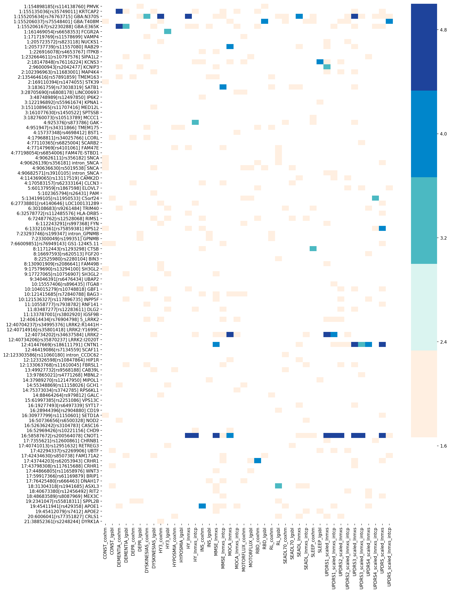

# progression GWAS project
​
## Pilot analysis for variants in interest
Recently Mike reported 92 risk variants for PD (https://doi.org/10.1101/388165). I added some more variants and anlyzed binomial/continous traits with the following 5 models adjusted for sex, years of education, family history, age at diagnosis, years from diagnosis, levodopa usage, DA usage, and PC1 to PC5.
​
1. lgsbl: Logistic regression for baseline binomial traits
2. coxhm: Cox hazard model until the patient has the binomial outcome. 
3. lnmxi: Linear mixed effect modeling of snp on intercept for the (continous) outcome
4. lnmxs: Linear mixed effect modeling of snp on slope (time-dependent-change) of the outcome
5. lncns: Conditional linear modeling of snp on slope (essentially similar to lnmxi, but the model is expansion of paired t-test, )
    
In total, 52 models were analyzed for each variants.
​
## Visualized the strength of the associations
92 variants in Meta-5.    
$n = number\ of\ models\ tested$ = 52
​
​
1. $0.05 \le P$
2. $\frac{0.05}{n} \le P < 0.05$
3. $\frac{0.05}{92} \le P < \frac{0.05}{n}$     
4. $\frac{0.05}{92 * n} \le P < \frac{0.05}{92}$
5. $ P < \frac{0.05}{92 * n}$
​
The interpretation would be,
1. no signal    
2. raw P < 0.05
3. FDR 0.05 across traits
4. FDR 0.05 across 92 variants 
5. FDR 0.05 across traits x 92 variants
​

Figure1: 
Variants on x axis and models on y axis. The bar at right is not showing numbers properly but each color is corresponding to each level of significance defined above (deeper color == stronger association). The same trait analyzed by different models are close each other. So a horizontal line indicates somewhat consistent phenotype-genotype associations.    
A couple of interesting points. conditional linear models for slope are the most sensitive analysis. (return more darker cells.)    
APOE1 is associated with insomnia, MMSE, and UPDRS1 on multple different models, and it seems sensible. 
    
I also conducted GWAS (integer genotypes imputed and filtered by maf>0.05 and Rsq > 0.8) but at this moment, models with binomial outcomes (lgsbl/coxhm) were reporting only sub-significant variants. (5e-7). And lncns analyses reported too many variants (9K+). Probably need to filter them with stricter thresholds.
​
## Next step
The above analyses were using old data I used for the previous 31 SNPs analyses. Some of you have alreaady sent me the updated files and I am looking forward to combine all the available updated files and do the anaylses again!
​
## Data request
If you can update the following data, please let me know. 
​
1. Covariates:  sex, years of education, family history, age at diagnosis, years from diagnosis, levodopa usage, DA usage, and PC1 to PC5
2. HY scale
2. UPDRS1-4 including scores for each item
3. Cognitive test (MoCA or MMSE) total score
4. Smell test score
5. SEADL
6. Diagnosis of Dementia/Cognitive impairment, Constipation, Depression, dyskinesia, motor fluctuation, insomnia, daytime sleepiness, hyposmia    
​
​
In addtion, I am planning to conduct pharmacogenetics GWAS withn PPMI and other available datasets. If you can also collaborate on this, please semd me the data from the any test data of **drug responsiveness** (on-off test/UPDRS measured twice a day...), and/or **the date started levodopa/DA treatment for each patients** so that I can distinguish the UPDRS, HY before and after the treatment initiation.

​

​

​

​
