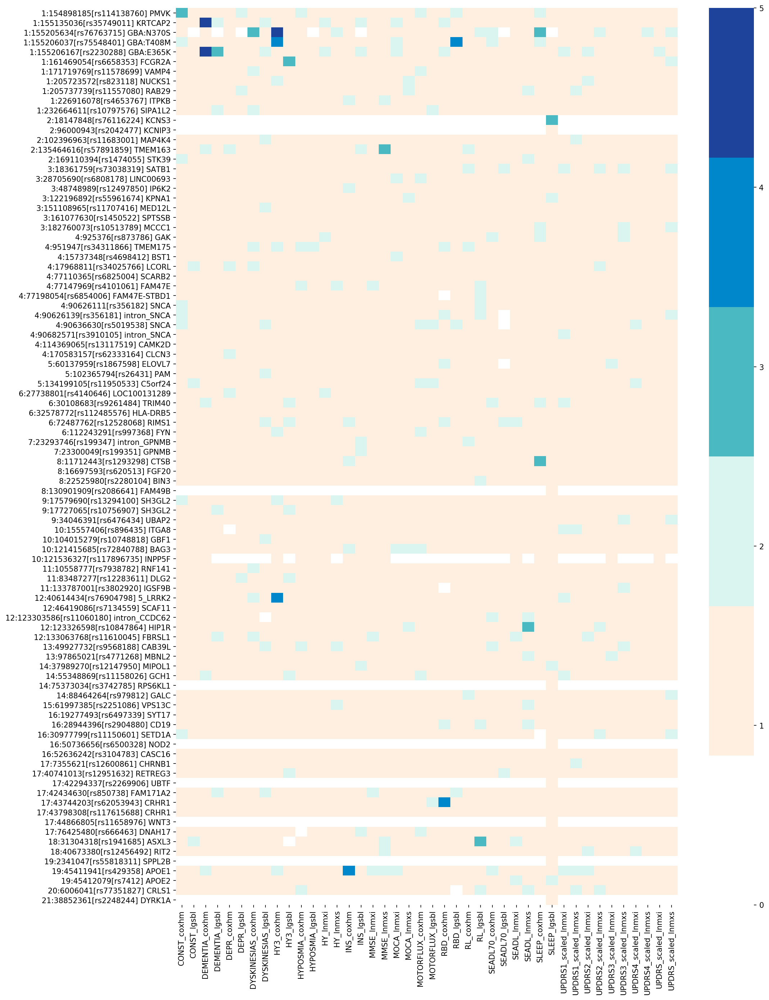

# progression GWAS project

## Pilot analysis for variants in interest
Recently Mike reported 92 risk variants for PD (https://doi.org/10.1101/388165). I added some more variants with these variants (such as GBA variatns and APOE1) and anlyzed binomial/continous traits with the following 5 models adjusted for sex, years of education, family history, age at diagnosis, years from diagnosis, levodopa usage, DA usage, and PC1 to PC5.

1. lgsbl: Logistic regression for baseline binomial traits
2. coxhm: Cox hazard model for a binomial outcome for those who didn't have the symptom at the baseline 
3. lnmxi: Linear mixed effect modeling of snp on intercept for the (continous) outcome
4. lnmxs: Linear mixed effect modeling of snp on slope (time-dependent-change) of the outcome

## Visualized the strength of the associations

$N_t$ = Number of tests per variants

$N_v$ = Number of variants per test

1. $0.05 < P$
2. $0.05 / N_t < P < 0.05$
3. $ 0.05 / N_v < P < 0.05 / N_t $     
4. $ 0.05 / (N_t * N_v) < P <  0.05 / N_v $
5. $ P < 0.05 / (N_t * N_v) $

The interpretation would be
1. no signal
2. raw P < 0.05
3. significant after bonferroni adjustment for Number of tests per variant
4. significant after bonferroni adjustment for Number of variants per test
5. significant after bonferroni adjustment for all tests

Figure1: 
Variants on y axis and outcome(\_model) on x axis. The bar at right is showing the level of significance defined above (deeper color == stronger association, white == no data available).    

## GWAS
I conducted GWAS (integer genotypes imputed and filtered by maf>0.05 and Rsq > 0.8) with the above models, but the current results were all sub-significant. (> 5e-8).

## Next step
The above analyses were using old data I used for the previous 31 SNPs analyses. Some of you have alreaady sent me the updated clincial files and I am looking forward to combine all the available updated files and do the GWAS anaylses again!

## Data request
If you can update the following data, please let me know. 

1. Covariates:  sex, years of education, family history, age at diagnosis, years from diagnosis, levodopa usage, DA usage, and PC1 to PC5
2. HY scale
2. UPDRS1-4 including scores for each item
3. Cognitive test (MoCA or MMSE) total score
4. Smell test score
5. SEADL
6. Diagnosis of Dementia/Cognitive impairment, Constipation, Depression, dyskinesia, motor fluctuation, insomnia, daytime sleepiness, hyposmia        
    
### In addtion..
I am planning to conduct pharmacogenetics GWAS withn PPMI and other available datasets. If you can also collaborate on this, please semd me the data from the any test data of **drug responsiveness** (on-off test/UPDRS measured twice a day, etc.), and/or **the date started levodopa/DA treatment for each patients** along with other data measuring motor features so that I can distinguish the observations before and after the treatment initiation.